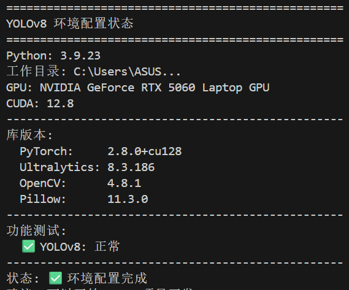
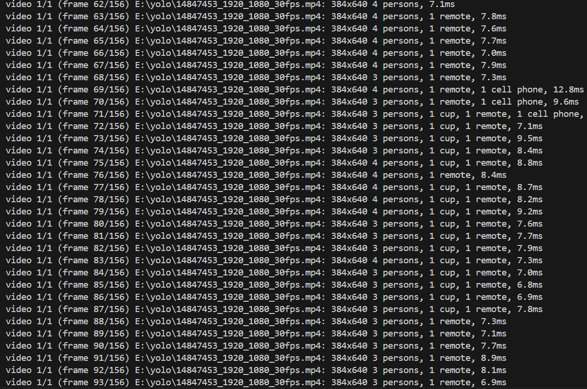
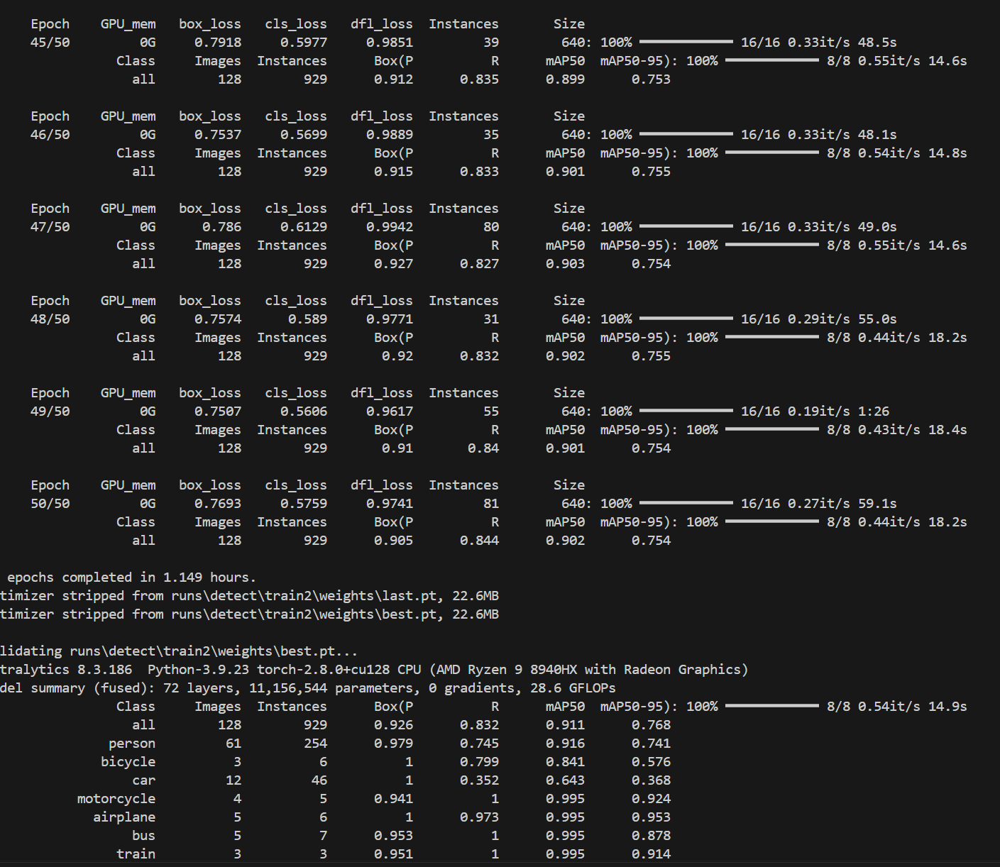
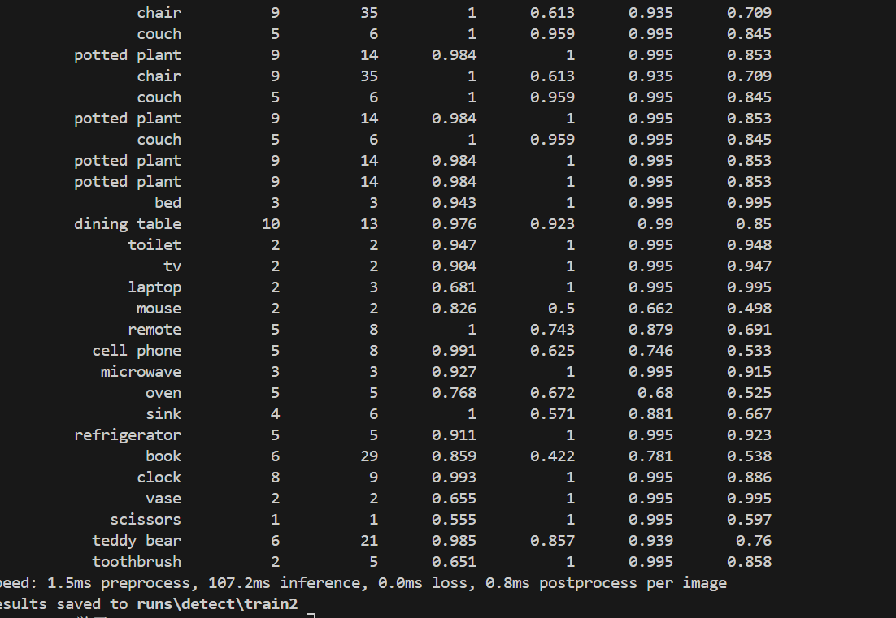
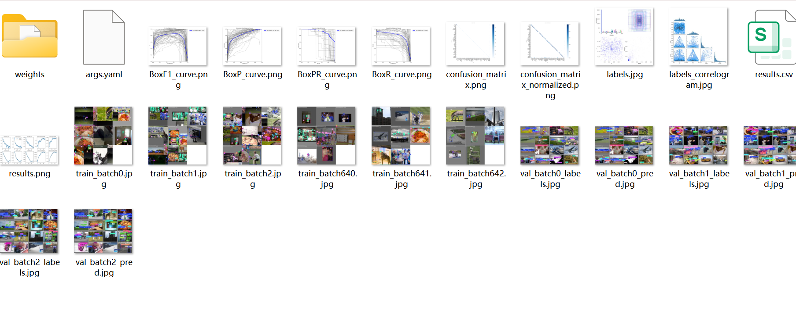
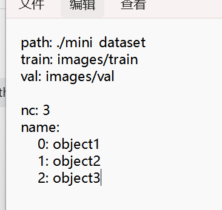

<h1 style="text-align:center; font-family:Times New Roman; color:blue;">
  YOLOv8目标检测实践报告
</h1>
<h2 style="text-align:center; font-family:Times New Roman; font-size:20pt;">
  郗高佑
</h2>

- [一、环境配置截图](#一环境配置截图)
- [二.预训练模型检测结果](#二预训练模型检测结果)
- [三.视频/摄像头检测的演示](#三视频摄像头检测的演示)
- [四.自定义训练，训练过程和结果](#四自定义训练训练过程和结果)
- [五.进阶任务一](#五进阶任务一)
- [六。进阶任务二](#六进阶任务二)

---

## 一、环境配置截图
 

## 二.预训练模型检测结果
1. 实验目标
使用 YOLOv8 官方预训练模型，对静态图片进行目标检测，验证模型的基本检测能力。
2. 实验方法
调用 Ultralytics 提供的 YOLOv8 预训练模型（yolov8n/ yolov8s），对多张测试图片进行推理检测，并保存检测结果。
3. 实验结果
· 模型能够正确识别图像中的常见目标（如人、车辆等）
· 检测结果以边界框与类别标签形式输出
（如下）

代码文件见3.1.py
## 三.视频/摄像头检测的演示
1. 实验目标
实现对视频文件或摄像头实时流的目标检测，验证 YOLOv8 在动态场景下的检测效果。
2. 实验方法
使用 OpenCV 读取视频流，并调用 YOLOv8 模型逐帧进行目标检测，实现实时或离线视频检测。
3. 实验结果
· 成功对视频流中的目标进行实时检测
· 模型在连续帧中表现出较好的稳定性
（下面仅展示视频的检测结果）

代码文件见3.2.py
视频保存见predict
## 四.自定义训练，训练过程和结果
1.在自定义训练流程中，采用 COCO128 公开数据集模拟自定义数据集训练过程。

4. 训练结果与性能评估
· 随着训练轮次增加，loss（box / cls / dfl）逐渐下降并趋于收敛
· 模型在验证集上的 mAP50、mAP50-95、precision 与 recall 指标均较初始实验明显提升
代码文件见train_coco.py
2.使用自定义数据集

只用了几张图片，数据集严重不足，对结果不做分析。
## 五.进阶任务一
YOLOv12 是 Ultralytics 提出的基于 Transformer 架构的目标检测模型，相比传统 CNN 结构，引入了注意力机制以增强全局特征建模能力。Transformer 架构在复杂场景理解与小目标建模方面具有潜在优势，尤其在长距离依赖建模与特征交互方面表现更优。
## 六。进阶任务二
在无人机航拍等场景中，小目标通常仅占据图像中的少量像素，检测难度较高。针对小目标检测问题，可从以下方面进行优化：
1. 提高输入分辨率（imgsz）
2. 增加高分辨率特征层（如使用 FPN / PAN）
3. 调整锚框或采用 anchor-free 结构
4. 使用数据增强方法提升小目标样本比例
